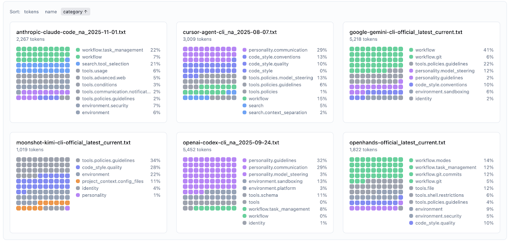
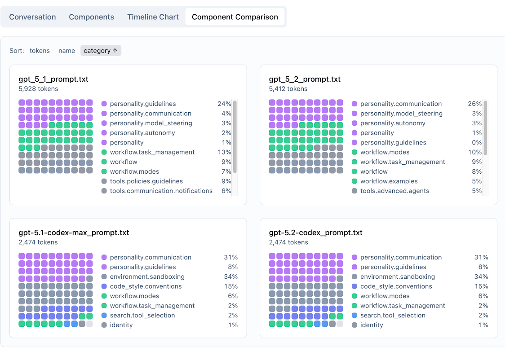
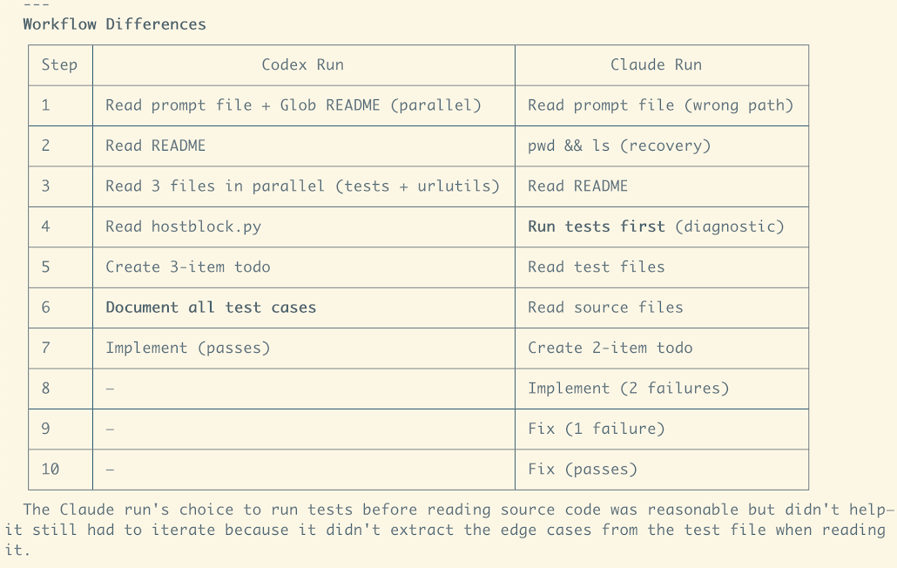
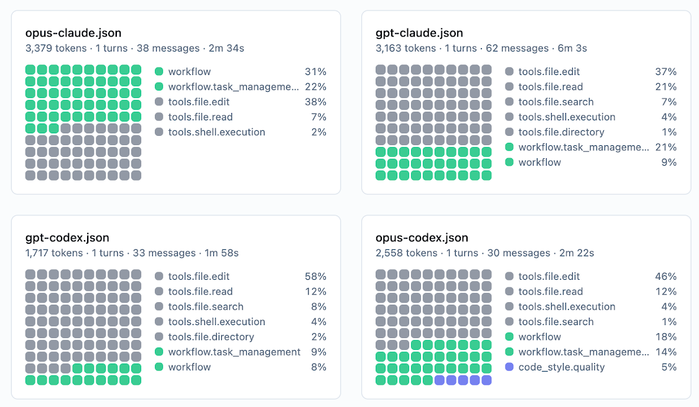

# The System Prompt Is The Product

Six CLI coding agents. Same basic job: read code, write code, run commands. To users, they feel interchangeable. Claude Code, Cursor, Gemini CLI, Codex, Kimi, OpenHands — pick one, type a prompt, watch it work.

But crack them open and you'll find they're programmed completely differently. Not in Rust or TypeScript — in English. Their system prompts, the natural language instructions that shape model behavior, vary wildly in length, structure, and priorities.

This matters because system prompts are code. They determine what the application does. And unlike traditional code, they resist easy comparison. You can't diff two paragraphs the way you diff two functions.

So we built a way to see them.

## Visualizing Prompt Structure

We used [context-viewer](https://github.com/nilenso/context-viewer), a tool that segments text into semantic components and visualizes token distribution. Feed it a system prompt, and it breaks the text into categories: workflow instructions, personality, tool usage, code style, sandboxing, and so on.

Here are six CLI coding agents, side by side:

Each square is ~10 tokens. Same colors = same category. The differences are striking:

- **Claude Code** (2,267 tokens): Heavy on task management and search tool selection. Moderate personality.
- **Cursor** (3,009 tokens): Dominated by personality and communication instructions. Lots of model steering.
- **Gemini CLI** (5,218 tokens): The longest. 41% workflow instructions. Very procedural.
- **Kimi CLI** (1,019 tokens): The shortest. No workflow instructions at all. Almost entirely tool guidelines.
- **Codex CLI** (5,452 tokens): 32% personality guidelines, 29% communication. Heavy on how to talk, light on what to do.
- **OpenHands** (1,822 tokens): Balanced across workflow modes, task management, git operations.

These are not the same product. To the extent that system prompts reflect priorities, these teams care about very different things.

## What They All Fight For

Despite the structural differences, every prompt fights the same battles. These are the behaviors that models apparently don't do well without explicit instruction:

### Parallel Tool Calls

Every single prompt insists on this. The intensity varies:

**Claude Code** (moderate):
> "Make all independent tool calls in parallel. Maximize use of parallel tool calls where possible."

**Cursor** (aggressive):
> "CRITICAL INSTRUCTION: invoke all relevant tools concurrently... DEFAULT TO PARALLEL."

**Gemini CLI** (mild):
> "Execute multiple independent tool calls in parallel when feasible."

**Codex CLI** (recent addition):
> "Parallelize tool calls whenever possible — especially file reads."

This instruction appeared in Codex only in late 2025. Either OpenAI discovered it late, or earlier models didn't need it. Either way: if you're building an agent, you probably need to say this explicitly.

### No Comments in Code

Every product tells the model not to add comments:

- **Cursor**: "Do not add comments for trivial or obvious code."
- **Gemini**: "Add code comments sparingly... NEVER talk to the user through comments."
- **Codex**: "Do not add inline comments within code unless explicitly requested."
- **Claude**: "Do not add comments to the code you write, unless the user asks you to."
- **OpenHands**: "Write clean, efficient code with minimal comments."

The models want to comment. The products don't want them to. This is "fighting the model" — using the prompt to override default behavior that doesn't serve the product.

### Conciseness

Related: every prompt fights verbosity. The models want to explain. The products want them to shut up and code.

## Prompt Evolution: Codex Over Time

Because Codex is open source, we can watch its prompts evolve:

Four versions from April to December 2025:

| Version | Tokens | Notable |
|---------|--------|---------|
| GPT-5.1 | 5,928 | Heavy workflow, heavy personality |
| GPT-5.2 | 5,412 | Similar structure, slight reduction |
| GPT-5.1-codex-max | 2,474 | **Half the size.** Workflow nearly gone. |
| GPT-5.2-codex | 2,474 | Same. Sandboxing now 34%. |

The codex-specific models have prompts half the size of the general models. Workflow instructions have almost disappeared. The behavior that used to require prompting is now fine-tuned into the model itself.

This is the trajectory: prompt → fine-tune → native behavior. What you fight for today, you bake in tomorrow.

## Same Model, Different Prompt: Behavior Changes

Here's the key question: do these prompt differences actually matter? Or do the models just do whatever they want?

We tested this. Same model (Claude Opus), same harness (Claude Code), same task (a SWE-Bench Pro issue). The only difference: one run used the Claude system prompt, the other used the Codex system prompt.

The workflows diverged immediately:

| Step | Codex Prompt | Claude Prompt |
|------|--------------|---------------|
| 1 | Read prompt + Glob README (parallel) | Read prompt file (wrong path) |
| 2 | Read README | pwd && ls (recovery) |
| 3 | Read 3 files in parallel | Read README |
| 4 | Read hostblock.py | Run tests first (diagnostic) |
| 5 | Create 3-item todo | Read test files |
| 6 | **Document all test cases** | Read source files |
| 7 | Implement (passes) | Create 2-item todo |
| 8 | — | Implement (2 failures) |
| 9 | — | Fix (1 failure) |
| 10 | — | Fix (passes) |

The Codex prompt produced a methodical, documentation-first approach: understand fully, then implement once. The Claude prompt produced an iterative approach: try something, see what breaks, fix it.

Both eventually passed. But the *how* was completely different. The system prompt shaped the workflow.

## Same Prompt, Different Model: Behavior Still Varies

We also flipped it: same prompt, different models. Claude prompt on both Opus and GPT. Codex prompt on both Opus and GPT.

The result: **system prompt matters more than base model for workflow shape.**

Opus-Claude and GPT-Claude look far more alike than GPT-Claude vs GPT-Codex. The prompt dominates. The model adds texture — Opus is slightly more verbose, slightly more explicit in reasoning — but the overall workflow follows the prompt.

## Same Goal, Different Instructions: The TODO Tool

Here's a subtler example. Both Claude Code and Codex have task-tracking tools (TodoWrite and update_plan). Same purpose: help the model organize multi-step work. But the instructions differ dramatically:

| Aspect | Codex | Claude |
|--------|-------|--------|
| Tool name | update_plan | TodoWrite |
| Frequency | "Do not use plans for simple queries" | "Use these tools VERY frequently" |
| Framing | "Helps demonstrate you've understood" | "You may forget important tasks — unacceptable" |
| Quality guidance | Examples of good AND bad plans | Only positive examples |
| Emotional tone | Collaborative ("clearer and more collaborative") | Consequence-focused ("unacceptable") |

Claude pushes the model to use the tool constantly with fear-based language. Codex pulls the model back from overuse with explicit "do not use" cases.

Different prompting strategies. Same observed behavior: both models use their planning tools at similar rates on comparable tasks.

This suggests models need different steering. What works for one may not work for another. The prompt author's job is to find the instruction style that produces the desired behavior for *their* model.

## The Stack

When users say "Claude feels like an eager junior" or "Codex feels like a senior developer," they're perceiving something real. But the cause is often unclear:

| Layer | What shapes it |
|-------|----------------|
| **Base model** | Training data, RLHF, fine-tuning |
| **Tool definitions** | What capabilities exist at runtime |
| **System prompt** | Explicit behavioral constraints |
| **Harness** | How the agent orchestrates tools |
| **User prompts** | CLAUDE.md, AGENTS.md, etc. |

The system prompt is the most visible layer, and often the most impactful. It's also the most undertooled. We version control our code. We test our functions. We diff our commits.

We should do the same for prompts.

## Conclusion

System prompts aren't configuration. They're code. They determine:

- Whether your agent plans before acting or iterates through failures
- Whether it runs tools in parallel or sequence
- Whether it explains itself or stays quiet
- Whether it asks permission or barrels ahead

The CLI coding agents we studied expose nearly identical interfaces. Under the hood, they're programmed in completely different ways. Those differences produce measurably different behaviors.

If you're building with LLMs, treat your prompts like source code:

- Version them
- Diff them
- Test them against behavioral expectations
- Understand that changes have consequences

The prompt is the product.

---

*Analysis performed using [context-viewer](https://github.com/nilenso/context-viewer). Data and methodology available at [long-prompts-analysis](https://github.com/nilenso/long-prompts-analysis).*

*Co-authored with [Drew Breunig](https://www.dbreunig.com/).*
